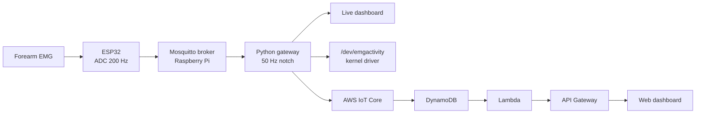

# EMG Telemetry Edge Node

A wireless biosignal telemetry system: an ESP32 reads a forearm muscle and **streams it over Wi-Fi (MQTT)** to a **Raspberry Pi running Linux**, which **filters the signal**, **serves a live dashboard**, **forwards it to the cloud**, and **exposes it through a hand-written Linux kernel driver**. It is the embedded-software and networked-Linux side of embedded engineering, applied to biosignals (the shape of remote biosignal monitoring), and a companion to my STM32 gripper project, which covers the bare-metal firmware side.

**Stack:** ESP32 (Arduino / PlatformIO) | Wi-Fi + MQTT (Mosquitto) | Python gateway with a 50 Hz notch filter | Raspberry Pi 5, embedded Linux + systemd | a hand-written Linux kernel character driver | AWS IoT Core -> DynamoDB -> Lambda -> API Gateway | GitHub Actions CI + pytest

https://github.com/user-attachments/assets/16f361af-d255-49c8-a993-ccd79eb3e1b7

**Demo (~1 min):** flex, and the live cloud dashboard and the kernel-driver readout react in sync, then a walk through the driver: kernel C, compiled, loaded, and serving the live signal at `/dev/emgactivity`.

---

## What it demonstrates

| Capability | How, in this project |
|---|---|
| Linux on a real embedded device | Raspberry Pi 5 (Raspberry Pi OS) runs the whole gateway |
| A hand-written Linux kernel driver | character device `/dev/emgactivity` ([`driver/emgactivity.c`](driver/emgactivity.c)) |
| systemd service management | gateway runs as an always-on, auto-restart unit ([`deploy/emg-gateway.service`](deploy/emg-gateway.service)) |
| Networking / MQTT | ESP32 publishes over Wi-Fi to Mosquitto; broker found by mDNS, no hardcoded IP |
| On-host DSP | 50 Hz RBJ notch filter, hand-rolled biquad ([`gateway/emg_gateway.py`](gateway/emg_gateway.py)) |
| Cloud IoT uplink | AWS IoT Core over mutual TLS -> DynamoDB -> Lambda -> API Gateway -> web dashboard ([`cloud/`](cloud/)) |
| CI + unit tests | GitHub Actions runs pytest on every push ([`gateway/tests/`](gateway/tests/), [`.github/workflows/ci.yml`](.github/workflows/ci.yml)) |
| Robust streaming | reconnect handling, sequence-number gap tracking (measured 0.00% loss on the LAN), batched publishing |
| Firmware sensing | ESP32 ADC sampled on a fixed `micros()` grid at 200 Hz ([`firmware/src/main.cpp`](firmware/src/main.cpp)) |

The biosignal part is reused on purpose: I know the EMG sensor from my M.Sc. thesis, so the work went into the gap skills (Linux, networking, CI, the kernel driver) rather than re-learning a sensor.

---

## Architecture

The muscle drives everything; the laptop is only there to flash the ESP32 and view the dashboard.



The ESP32 samples the EMG and publishes batches over MQTT. On the Pi, Mosquitto receives them and the Python gateway filters each sample (50 Hz notch), re-publishes the cleaned stream, computes a rolling activity level, and fans that level out three ways: a live local dashboard, a decimated cloud uplink over mutual TLS, and the kernel driver below.

---

## The Linux kernel driver

The new surface in this project is a real kernel module, written in C, running on the Pi. [`driver/emgactivity.c`](driver/emgactivity.c) registers a **character device** at `/dev/emgactivity` using the kernel's misc-device framework. It implements the `file_operations` interface (`open`, `read`, `write`, `release`), moves data across the kernel and userspace boundary with `copy_to_user` / `copy_from_user`, and guards a small in-kernel buffer with a mutex.

In the running system the gateway writes the live muscle activity level into the device, so any program (or `cat /dev/emgactivity`) reads the current contraction level straight out of the kernel module:

```bash
watch -n 0.2 cat /dev/emgactivity   # ~40 at rest, ~200+ on a flex
```

Honest framing: a character device is the standard Linux way to surface a value to userspace (the kernel's IIO subsystem does this for real sensors). Here the value arrives at the Pi over Wi-Fi from the ESP32 and is fed in by the userspace gateway, rather than read off a local pin in kernel space. The module demonstrates the driver interface end to end on real hardware, integrated into the telemetry system.

Build it on the Pi against the kernel headers:

```bash
cd driver
make                          # builds emgactivity.ko
sudo insmod emgactivity.ko    # or let the gateway service load it
```

The gateway service loads the module on startup ([`deploy/emg-gateway.service`](deploy/emg-gateway.service), `ExecStartPre`), so `/dev/emgactivity` is present after a reboot.

---

## The gateway and the signal chain

[`gateway/emg_gateway.py`](gateway/emg_gateway.py) is the headless service. It subscribes to the raw stream, applies a 50 Hz notch (a hand-rolled RBJ biquad, the same DSP from the thesis work), re-publishes the filtered stream, and tracks dropped samples by watching the sequence index (measured 0.00% loss on the LAN; a forced broker restart cost exactly two samples, all caught). It reconnects on its own if the broker or network drops.

The processing logic is split from the I/O so it can be unit-tested: [`gateway/tests/`](gateway/tests/) runs under pytest (the notch kills a 50 Hz tone and preserves a 5 Hz EMG-like signal, batch parsing handles good and malformed payloads, the gap counter handles drops and stream restarts). GitHub Actions runs the suite on every push.

Other gateway pieces: [`gateway/emg_monitor.py`](gateway/emg_monitor.py) is a live pyqtgraph scope, [`gateway/emg_subscriber.py`](gateway/emg_subscriber.py) a minimal rate/value subscriber, [`gateway/emg_debug.py`](gateway/emg_debug.py) captures the raw stream for offline analysis.

---

## The cloud uplink

The gateway also bridges a decimated activity feed (about 5 per second) to **AWS IoT Core** over mutual TLS with a device certificate. An IoT Rule writes each reading to DynamoDB, a Lambda ([`cloud/emg_readings_lambda.py`](cloud/emg_readings_lambda.py)) serves the latest readings behind API Gateway, and a small web page ([`cloud/dashboard.html`](cloud/dashboard.html)) polls that API and draws the live level. The local pipeline is unchanged; the cloud is one branch off the gateway.

---

## Hardware

| Part | Role |
|---|---|
| ESP32 dev board | reads the EMG and streams it over Wi-Fi; powered from a USB battery for a clean analog ground |
| Grove EMG detector + electrodes | analog EMG envelope into the ESP32 ADC (GPIO32) |
| Raspberry Pi 5 | the embedded-Linux gateway: Mosquitto broker, Python service, kernel driver |

---

## Build and run

ESP32 firmware (PlatformIO):

```bash
cd firmware
pio run -t upload         # flash over USB; copy secrets.h.example to secrets.h first
```

Gateway on the Pi (Python 3.12):

```bash
cd gateway
python3 -m venv venv && venv/bin/pip install -r requirements.txt
venv/bin/python emg_gateway.py
```

The broker config is [`gateway/mosquitto-emg.conf`](gateway/mosquitto-emg.conf); the optional cloud branch reads [`gateway/aws_config.py`](gateway/aws_config.py) (template provided) and runs local-only if it is absent. Running the gateway as a service is covered by [`deploy/emg-gateway.service`](deploy/emg-gateway.service).

---

## Repo layout

```
firmware/        ESP32: read the EMG, publish over Wi-Fi/MQTT (PlatformIO)
  src/main.cpp   sampling at 200 Hz, batching, mDNS broker discovery, reconnect
gateway/         the Raspberry Pi service
  emg_gateway.py notch filter, re-publish, drop tracking, cloud uplink, device write
  emg_monitor.py live pyqtgraph dashboard
  tests/         pytest: notch, batch parsing, gap counter
driver/          the Linux kernel driver
  emgactivity.c  character device /dev/emgactivity
  Makefile       out-of-tree build against the Pi kernel headers
cloud/           AWS side: Lambda read API + a web dashboard
deploy/          systemd unit (loads the driver, runs the gateway)
.github/         GitHub Actions CI (pytest)
```

---

## Background and contact

This is the networked-Linux companion to my STM32 myoelectric gripper. Both reuse the single-channel sEMG work from my M.Sc. thesis:

- Journal article (IJANSER, 2024): https://as-proceeding.com/index.php/ijanser/article/view/1728
- Extended arXiv preprint: https://arxiv.org/abs/2504.15256

**Ken KADILAR** | embedded software / Linux / IoT  
Portfolio: [canarchive.com](https://canarchive.com)  
LinkedIn: [ken-kadilar](https://www.linkedin.com/in/ken-kadilar/)  
Email: kenkadilar@gmail.com
